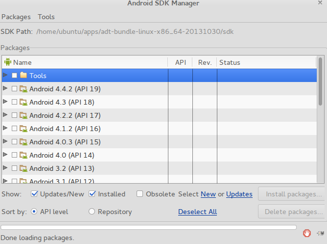
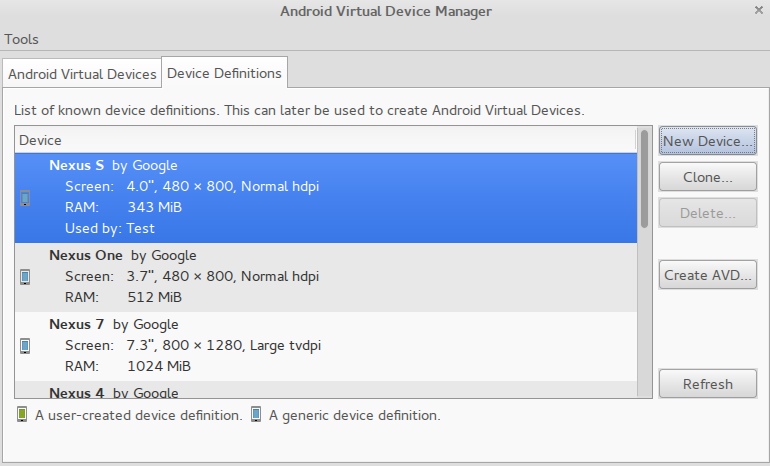

# Grada.me мобилно приложение
Мобилното приложение за: http://www.grada.me/


## Изисквания:
  - java
  - ant
  - nodejs
  - npm

## Подкарване

### Инсталация и настройки на Android SDK

Сваляте Anroid SDK http://developer.android.com/sdk/index.html

Разархивирате някъде сваленото

Добавяте към системната променлива `$PATH` още 2 директори:

 - `/път/до/разархивирания/SDK/adt-bundle-<версия>/sdk/tools`
 - `/път/до/разархивирания/SDK/adt-bundle-<версия>/sdk/platform-tools`

Тествайте като напишете в терминал: `android`. Би следвало да се отвори прозорец като този:



Тикнете всичко от последната версия `Android ...`. По време на писането на този документ последната версия е `4.4.2 (API 19)`

Натиснете `Install Packages` и изчакайте.

#### Създаване на симулатор
Затоврете прозорецa, като е готово, и изпълнете `android avd`, което ще покаже прозорец като този (*на screenshot-a е превключено на втория таб*):



Избирате си устройство и натискате `Create AVD` . Нов прозорец се появява. В него е препоръчително:

  1. да смените `ram`-та на не по-малко от `1024`.
  1. изберете `Target` последната версия `Android ...`
  1. `Internal Storage` - 2000
  1. `SD Card` - 2000
  1. `Use Host GPU` - тикнато
  1. `Back Camera` - изберете уеб камерата си ако имате такава, ако не Emulated

Ако е възможно зададете `CPU/ABI` на `Intel Atom (x86)`


### Инсталация и настройки на ionic, cordova, phonegap
Чрез мениджъра за пакети на `nodejs`:

```
(sudo) npm -g install ionic
(sudo) npm -g install cordova
(sudo) npm -g install phonegap
```

### Тест

Изпълнете:

```
ionic start my-first-project
cd my-first-project
phonegap run android
```

Което ще:
 1. създаде примерен проект с примерно приложение
 1. ще се опита да инсталира приложението на създадения симулатор
 1. ще стартира симулатора

Стъпка **2** може да се провали първия път, но има автоматичен повторен опит. Ще се появи екрана на симулатора и ще трябва да почакате да зареди. Може да зареди доста бавно (*става дума за минути*).

Щом се стартира отново изчакайте, понеже phonehap приложението би трябвало автоматично да се стартира.

## По-бърз симулатор за андорид

Това е възможно когато:

 1. при създаване на симулатор зададете `CPU/ABI` да бъде `Intel Atom (x86)`, а не `ARM`
 1. процесорът Ви поддържа `VT` или `AMD-V` виртуализация. Повечето по-нови процесори го поддържат.

### За "Mac" и "Windows"

Проверете дали процесора ви поддръжа този вид виртуализация.

И вече процедурата по инсталацията може да се прочете тук:

 - http://stackoverflow.com/a/13856866/339872
 - или тук: http://software.intel.com/en-us/articles/speeding-up-the-android-emulator-on-intel-architecture#_Toc358213271

### Linux

Проверете дали процесорът Ви поддържате `VT` или `AMD-V` чрез:

```
egrep '^flags.*(vmx|svm)' /proc/cpuinfo
```

Ако командата **не** изведе инфо на екрана, значи процесорът ви **не** поддържа този вид виртуализация.

#### И вече процедурата по инсталацията

За "ubuntu" тук:
http://software.intel.com/en-us/articles/speeding-up-the-android-emulator-on-intel-architecture#_Toc358213272

За Fedora и други системи базирани на `yum` и `systemctl` командите са следните:
```
sudo yum install @virtualization
sudo systemctl start libvirtd
sudo systemctl enable libvirtd
sudo gpasswd -a ubuntu kvm
```

